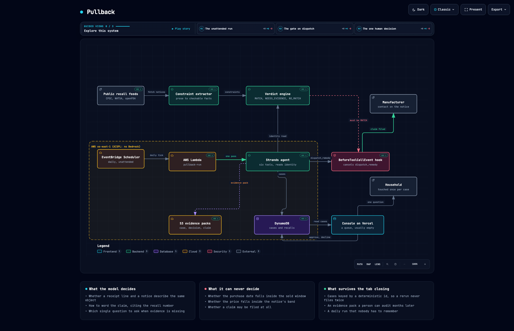

# Pullback

An agent that finds out whether something in your home has been recalled, then
gets the manufacturer's remedy delivered. It runs on a schedule, in the
background, and interrupts you only when a decision is genuinely yours.

Built with the [Strands Agents SDK](https://strandsagents.com).



## The problem, measured rather than asserted

Run this yourself; it takes two seconds and needs no key:

```bash
curl -s "https://www.saferproducts.gov/RestWebServices/Recall?format=json&RecallDateStart=2026-01-01" | jq length
```

That is every consumer product recall the CPSC published in 2026. At the time
this was written the answer was **434**. Of those notices:

| | |
|---|---|
| involve products for children | **42%** |
| have the word "death" in the title | **317 of 434** |
| carry a UPC you could look your purchase up by | **3%** |
| carry a model number | **0%** |
| state where and when the product was sold | **94%** |
| state what it cost | **94%** |
| print an address to claim the remedy from | **92%** |

Those numbers are produced by `scripts/measure_feed.py`, not by hand.

This is why you have never once been told that something in your house was
recalled. There is no identifier to join on. A recall notice is a paragraph
written by a lawyer describing packaging:

> This recall involves California Cade Electronic Finger Lights which contain
> three button cells batteries. The finger lights come in 50 pieces in a box in
> white, blue, red and green.

And your receipt says `LED projecting finger lights party favors 50 pieces`.
Those are the same object. No database join will ever say so.

## What Pullback does about it

The model does the reading. That comparison above is reading comprehension, and
it is the one part of this problem a language model is genuinely better at than
a rule.

**The model does not do the deciding.** Whether the purchase falls inside the
notice's sold window, inside its price band, at one of its retailers, or matches
its UPC is arithmetic, and it happens in `agent/engine/verdict.py` where no
prompt can reach it. The engine returns one of three outcomes and the model is
told the result:

- `MATCH` every checkable constraint passed, so a claim may be filed
- `NEEDS_EVIDENCE` what passed is not enough, and one specific missing fact would settle it
- `NO_MATCH` something failed, so say nothing, ever

That separation is enforced twice. Once at `judge_identity`, which accepts the
model's read but returns the computed verdict. And once by `RemedyVeto`, a
Strands `BeforeToolCallEvent` hook that cancels `dispatch_remedy` unless the run
ledger holds a MATCH verdict and a written claim for that exact case.

Delete the hook and the test suite goes red by filing a real claim for a product
the household does not own:

```
--- with the veto hook removed:
{"event": "dispatched", "detail": "8fe9227a49206dca -> recall@habausa.com"}
FAILED tests/test_veto.py::test_the_hook_cancels_a_dispatch_that_is_actually_attempted
1 failed, 6 passed
--- restored:
459 passed
```

## A real run

15 purchases in a household, checked against all 434 live notices:

```
{"event": "run_started", "purchases": 15, "recalls": 434, "source": "live CPSC feed"}
{"event": "verdict",  "detail": "amz-2026-0412 vs 26719: MATCH (4 checks passed, 0 failed)"}
{"event": "case_opened", "detail": "43f87bbe8aaf308d awaiting_approval"}
{"event": "claim_written", "detail": "43f87bbe8aaf308d cites 26719"}
{"event": "dispatched", "detail": "43f87bbe8aaf308d -> recall@habausa.com"}
```

`recall@habausa.com` is not a fixture. It is the address printed on
[recall 26719](https://www.cpsc.gov/Recalls), the HABA Rainbow Rattle, whose
glued knot can come untied and release small parts to a child.

The decision behind that claim, rendered so a person can audit it:

```
pass retailer:             'Amazon.com' appears in the notice
pass sold_window:          bought 2026-04-12 inside sold window 2025-12-01..2026-07-31
pass price_band:           paid $12.99 inside $10.40..$15.60
pass identity[claude]:     the notice describes a wooden rattle on an elastic cord
                           sold as a grasping and teething toy (confidence 0.94)
```

Across the household: 68 pairs were worth considering, 6 came back MATCH, 1
needed one question answered, and 61 were cleared silently. Silence is most of
the output and it is the correct output.

## Running it

```bash
git clone https://github.com/kamalbuilds/pullback && cd pullback
python3.12 -m venv .venv && .venv/bin/pip install -e .
echo "ANTHROPIC_API_KEY=sk-..." > .env        # you place this, nothing else needs a key
.venv/bin/python -m pytest tests -q           # 459 tests, no network, no credentials
```

One pass over the demo household against the live feed:

```bash
set -a && . ./.env && set +a
.venv/bin/python -m agent.run --live --days 400
```

Add `--dynamo` to persist cases to DynamoDB instead of local files. Deploy the
unattended daily run with `./infra/deploy.sh`.

## How it is put together

| Piece | What it is |
|---|---|
| `agent/feeds/` | CPSC, NHTSA and openFDA adapters. Each reduces its regulator's prose to one `Constraints` shape. |
| `agent/engine/verdict.py` | The decision. Dates, money, identifiers. No model. |
| `agent/engine/scan.py` | Narrows 434 notices to the handful worth a decision. |
| `agent/pullback_agent.py` | The Strands agent, its six tools, and the veto hook. |
| `agent/store.py` | DynamoDB cases keyed by a deterministic case id, so a rerun never files twice. |
| `agent/evidence.py` | The S3 pack a person can audit months later. |
| `infra/` | Lambda for the unattended run, EventBridge Scheduler for the daily loop. |
| `console/` | The decision queue. Its healthy state is empty. |

## A note on Bedrock

The AWS account used for this build is an AWS India (AISPL) account. Bedrock and
Bedrock AgentCore are not offered on AISPL accounts: every model in every region
returns `Operation not allowed`, and AgentCore returns `Access Denied ... Contact
customer support`. The console playground fails identically for the account
administrator, so it is not a permissions problem that could be fixed here.

Strands is model-agnostic by design, which is the reason that was survivable.
The agent runs on Anthropic directly, and the rest of the system runs on AWS:
Lambda, EventBridge Scheduler, DynamoDB, S3. The architecture diagram marks the
seam rather than hiding it.

## License

MIT. See [LICENSE](LICENSE).
